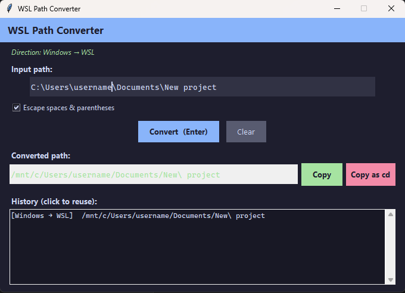

# WSL Path Converter

A lightweight, fully offline tool for converting paths between Windows and WSL (Linux) formats. No internet connection required, no dependencies beyond the Python standard library.

 



## Download

**No Python required** — just download and run:

👉 **[Download WSLPathConverter.exe](../../releases/latest)** (Windows, standalone)

Or if you have Python 3.8+, clone and run directly — see [Usage](#usage) below.

## Why this exists

If you're **vibe coding** — using AI tools like GitHub Copilot, Cursor, or Claude to build things fast — your workflow probably looks like this: code in Windows, run and test in WSL. That means you're constantly copying paths from Explorer or your IDE and needing them in a WSL terminal. The mental overhead of translating `C:\Users\me\project` → `/mnt/c/Users/me/project` and escaping spaces breaks your flow right when you want to stay in it.

WSL ships with a built-in `wslpath` command, but it only works *from inside WSL*. This tool lives on the Windows side, converts in one click, and copies a ready-to-paste `cd` command to your clipboard. Zero friction, zero internet required.

## Features

- **Bidirectional** — converts Windows → WSL (`C:\…` → `/mnt/c/…`) and WSL → Windows (`/mnt/c/…` → `C:\…`) automatically
- **Auto-detects direction** — just paste any path and it figures out which way to convert
- **Live conversion** — result updates as you type
- **Copy as `cd`** — copies the full `cd <path>` command ready to paste into your WSL terminal
- **Shell-escape toggle** — optionally escapes spaces and parentheses for safe shell use
- **Conversion history** — last 50 conversions listed; double-click to reload any entry
- **Fully offline** — no network calls, no telemetry, no external packages
- **Dark theme** GUI built with Tkinter (included in Python)

## Requirements

- Python 3.8 or newer (standard library only — no `pip install` needed)

## Usage

### GUI (recommended)

```bash
python wslpath_gui.py
```

| Action | How |
|---|---|
| Convert | Type/paste path → result appears live; or press **Enter** |
| Copy path | Click **Copy** |
| Copy as shell command | Click **Copy as cd** |
| Reverse a previous conversion | Double-click an entry in the History panel |
| Clear | Press **Esc** or click **Clear** |

### CLI

```bash
python wslpath_conv.py "C:\Users\name\Documents\My Project"
# → /mnt/c/Users/name/Documents/My\ Project

python wslpath_conv.py C:\Users\name
# → /mnt/c/Users/name
```

## How it works

1. Detects the drive letter (e.g. `C:`) and maps it to `/mnt/c/`
2. Replaces all backslashes with forward slashes
3. For WSL → Windows, reverses the `/mnt/<drive>/` prefix back to `<DRIVE>:\`
4. Optionally shell-escapes spaces (`\ `) and parentheses (`\(`, `\)`)

## License

MIT
